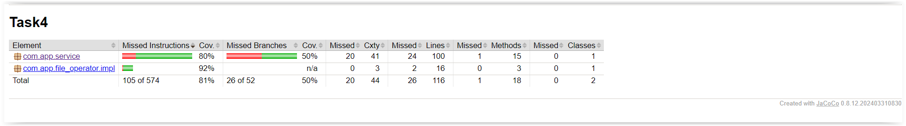

# Handling numbers in lists

The project involves the implementation of the List class, which processes data contained in a text file. This file contains lines, each of which contains three integers separated by a semicolon, e.g.: 32;56;10. The List class stores this data in three separate lists: the smallest, average, and largest numbers from each row. Furthermore, the class offers various methods for analyzing and processing this data

## Technologies and libraries used

* Java
* Maven
* Lombok
* JUnit
* AssertJ

## Jacoco Coverage

## Required files

* File with pattern ( csv ):

  num(integer);num(integer);num(integer)

## Description

### ListsService Class:
* Fields:
  * list1: A list that stores the smallest numbers from each row.
  * list2: A list that holds the second largest numbers from each row.
  * list3: A list that stores the largest numbers on each row.

* Constructor:

Takes a filename as an argument.
Reads data from a file and completes list1, list2, list3.

Methods:
* Loading Data
* Checking Perfect File
* Finding numbers to remove to make the file perfect
* Difference Between Biggest and Smallest
* Longest Non-increasing Sequence
* Maximum and Minimum Difference Index